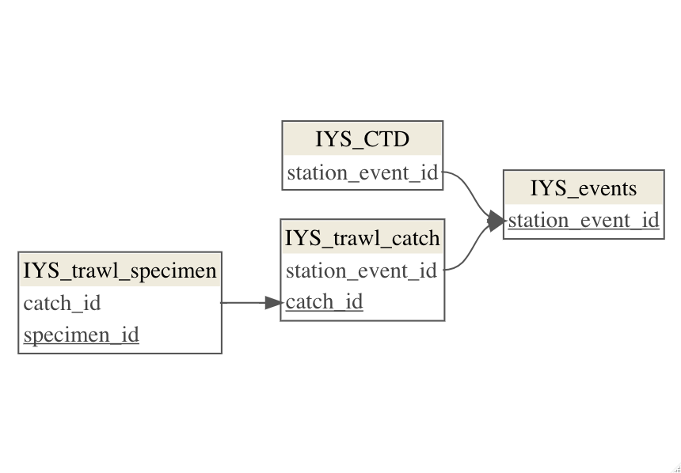

## Hi there 👋

🙋 Welcome to the repository for the Integrated Data Collection. The dataset in the root of this folder called 'IYS_Integrated_Data_Collection' is a collection of all the International Year of the Salmon High Seas Expedition data integrated so far.

See the Changelog.txt file to get updates on what's changed between dataset versions.

🤖 See the metadata record for this dataset here: https://doi.org/10.21966/81jn-6p63

Recommended citation: 

Pakhomov, E., Weitkamp, L., Neville, C., Somov, A., King, J., Farley, E., Hunt, B., Freshwater, C., Murphy, J., van der Stap, T., Johnson, B., Kivva, K., Esenkulova, S., Urawa, S., Waters, C., Vazhova, A., Radchenko, V., Riddel, B., Beamish, R., … Saunders, M. (2023). Integrated Data Collection from the International Year of the Salmon High Seas Expeditions (4th ed.) [Data set]. North Pacific Anadromous Fish Commission. https://doi.org/10.21966/81jn-6p63

🐟 The repository is structured as follows: 
  * `input_datasets` contains processed data files (not standardized) that have been sent to the IYS Data Scientists.
  * `output_datasets` contains the individual integrated datasets specific to a data type (i.e. bridgelog, trawl, specimen, CTD). 
  
  These datasets are aggregated and integrated within the IYS_Integrated_Data_Collection_Vx workbook, with x being the latest released version. 
  
  * `archived_versions` contains older versions of the IYS_Integrated_Data_Collection.xlsx file. Any changes between versions are recorded in the Changelog. 
  * `scripts` contains the code used to format and integrate the input datasets into the individual output datasets and the master file.

🦐 Check out our about page for more info! https://international-year-of-the-salmon.github.io/about/index.html

### Entity Relationship Diagram

The Integrated Data Collection can be joined together using the columns that each table has in common.

